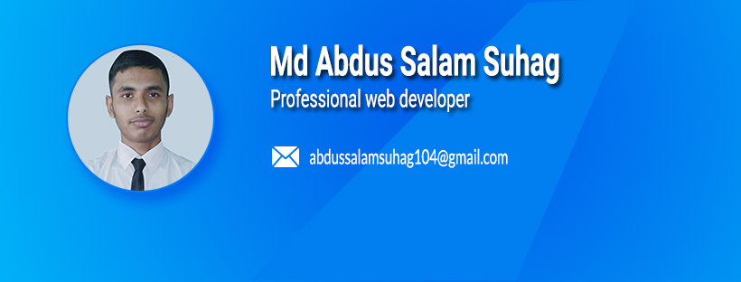
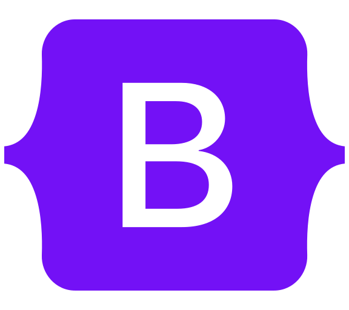

<!-- banner image starts here  -->

<!-- banner image ends here  -->

<!-- Heading Start here-->
# 👋 Hello! I'm Md Abdus Salam Suhag.
<!-- Heading end here-->
## Welcome to my github profile.❤️
<!-- About me start here-->
### 👨‍🏫About Me

 I am a web developer and student. I like to code with fun.🌱I use various technology and tool to create website like HTML, CSS, BOOTSTRAP, JAVASCRIPT ,REACT, JQUERY, GIT, GITHUB and more...😊

<!-- About Me end here-->  

### ✨My Skills in webdesign and development
 
 
  
 
 
 
 
 
 
   
   
  
 
 ### ✨Other Skills
 
  
 
  
 
 
 <ul>
 <li>Adobe Photoshop</li>
 <li>Adobe Illustrator</li>
 <li>Ms Word</li>
 <li>Ms Powerpoint</li>
 <li>Ms Excel</li>
 <li>Ms Access</li>
 <li>Camtasia</li>
 </ul>

### 🏫Education
<ol>
  <li>Diploma in computer technology</li>
  Habigonj Polytechnic Institute  
  Habigonj, Bagladesh.
 <li> SSC in Science</li>
  Shaistagonj High School 
 Shaistagonj, Habigonj
</ol>

### 🌐Languages

<ul>
 <li>🇧🇩Bangla: Native</li>
 <li>🏴󠁧󠁢󠁥󠁮󠁧󠁿English: Intermediate</li>
 <li>🇮🇳Hindi: Basic</li>
</ul>

### 🔥Hobbies

<ul>
 <li>🏏Cricket, 🏸Badminton</li>
 <li>✈️Traveling</li>
 <li>📚Reading, coding</li>
</ul>

---

Thanks for going through my Portfolio.
All rights reserved by Md Abdus Salam Suhag @2022

---
<!---
md-suhag/md-suhag is a ✨ special ✨ repository because its `README.md` (this file) appears on your GitHub profile.
You can click the Preview link to take a look at your changes.
--->
